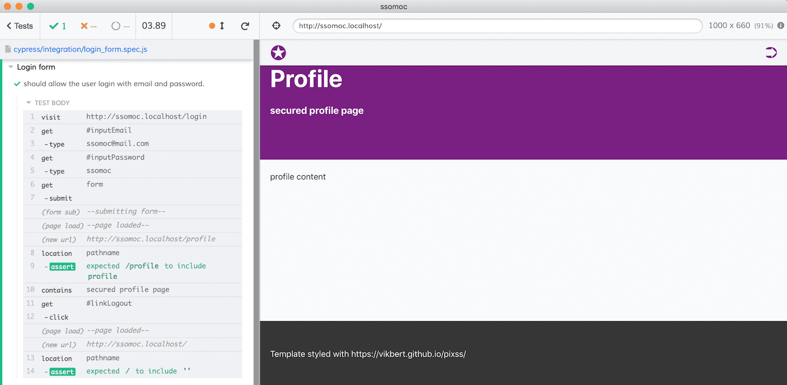

<div align="center">
    <h1 style="font-weight: bolder; margin-top: 0px" class="opacity-75">SSOmoc</h1>
    <h3 class="opacity-50">Single-Sign-On + Mocked Oauth2</h3>
</div>

<div align="center">
  <!-- 
  <h3>A pragmatic CSS for Minimalist</h3> -->
  <p>ssomoc implements both classic authentication with <strong>login form</strong> and <strong>sso authentication</strong> via oauth2-mock-api</p>

  <p>
    <a href="#">
      
    </a>
    <a href="#">
      
    </a>
  </p>
</div>

---

A Proof-of-concept of Single-Sign-On(SSO) in a standard Symfony 5 application with php 8.


## Start the containers

```
git clone https://github.com/vikbert/ssomoc.git
cd ssomoc
docker-compose up -d
```

## Compose Install

```bash
docker-compose exec php composer install
docker-compose exec php bin/console doctrine:database:create --if-not-exists -n
docker-compose exec php bin/console doctrine:migrations:migrate -n
```

## Localhost

add `ssomoc.localhost` to `/etc/hosts`, then go to [http://ssomoc.localhost](http://ssomoc.localhost)

## Authentication
there are `3x` options to authenticate the client in this demo project.
- login `form`
- sso via `oauth2`
- X-AUTH-TOKEN via `token`

See the details in `LoginFormAuthenticator`, `Oauth2Authenticator`, `TokenAuthenticator` in `src/Security` and the guard configuration in `security.yaml`


### Option 1: authentication via `login form`

classic login form with `email` and `password`: go to `http://ssomoc.localhost/login` and do login with `email` and `password`.

```bash
 # see the credentials in security.aml
 user: ssomoc@mail.com
 pass: ssomoc 
```


### Option 2: authentication via `sso oauth2`

sso via oauth2 (mock API): on the homepage, click on the button `SSO Login`


### Option 3: authentication via `X-AUTH-TOKEN`
It can be tested in curl or in REST client. The `X-AUTH-TOKEN` will be persisted in browser cookie under the name `authToken`, after a successful `sso-login` or `default login`.

```bash
curl -i -X GET \
   -H "X-AUTH-TOKEN:3e5a75e5-c3c1-4e56-9ad5-65657f1afb9c" \
 'http://ssomoc.localhost/api/todos' 
```


## Routing

```bash
➜ docker-compose exec php bin/console debug:router
 ------------------- -------- -------- ------ --------------------------
  Name                Method   Scheme   Host   Path
 ------------------- -------- -------- ------ --------------------------
  
  api_mock_authz      GET      ANY      ANY    /api/oauth/mock/authz
  api_mock_token      POST     ANY      ANY    /api/oauth/mock/token
  api_mock_userinfo   GET      ANY      ANY    /api/oauth/mock/userinfo

  api_sso_check       GET      ANY      ANY    /api/sso/check
  api_sso_info        GET      ANY      ANY    /api/sso/info
  api_sso_login       POST     ANY      ANY    /api/sso/login

  api_todos           GET      ANY      ANY    /api/todos

  app_home            ANY      ANY      ANY    /
  app_profile         GET      ANY      ANY    /profile
  app_login           ANY      ANY      ANY    /login
  app_logout          ANY      ANY      ANY    /logout
 ------------------- -------- -------- ------ --------------------------
```

#### api_mock_*
> there are 3x mocked APIs as the replacement of the classic oauth2 REST API

#### api_sso_*
> To make the sso possible in a PHP or SPA or mobile APP, there are 3x utility APIs to construct the SSO authorization-code-flow.

#### api_*
> the dummy restful resource API, which is authenticated with additional header `X-AUTH-TOKEN`

#### app_*
> they are the standard symfony application routes

## E2E Tests
`login via form`, `login via sso` are tested by cypressE2E tests. To start the tests:
```bash
docker-compose up -d # be sure that `http://ssomoc.localhost` is reachable.
npm install
make tests
# or
node_modules/cypress/bin/cypress open 
```


## licence

MIT [@vikbert](https://vikbert.github.io/)
